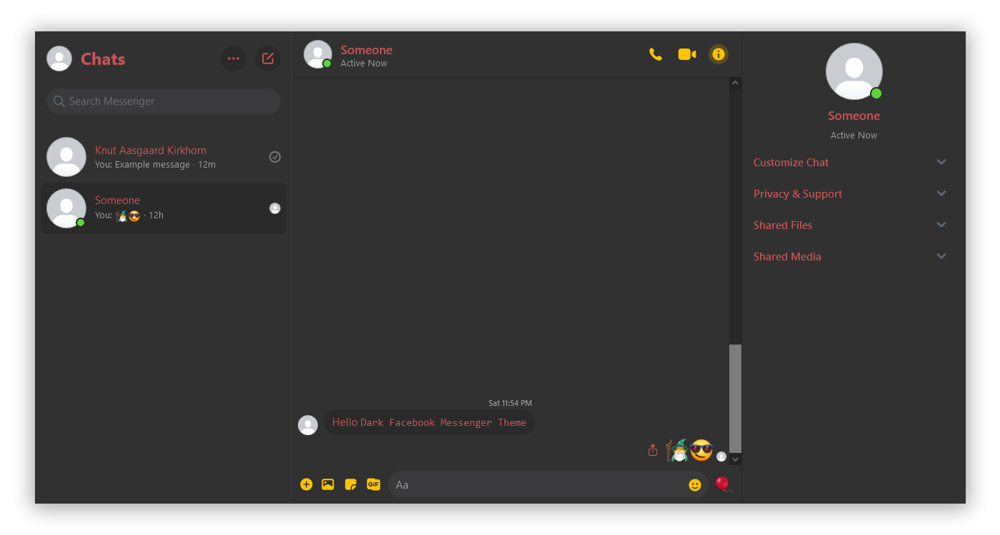

<h1 align="center">
	 
	
	 
	 
	 
</h1>

> 🕶️ Cool dark red Facebook Messenger theme

	

## Installation
### Using the browser plugin Stylus
1. Get the [Stylus](https://github.com/openstyles/stylus) plugin:
    - For [Firefox](https://addons.mozilla.org/en-US/firefox/addon/styl-us/)
    - For [Chrome](https://chrome.google.com/webstore/detail/stylus/clngdbkpkpeebahjckkjfobafhncgmne)
2. Click [here](https://raw.githubusercontent.com/knutkirkhorn/dark-facebook-messenger-theme/main/dark-facebook-messenger-theme.user.css) to install the theme using Stylus.
3. Click <kbd>Install style</kbd> and go to https://www.messenger.com or https://facebook.com/messages to view the result️️

#### Alternative manual installation
1. Get the [Stylus](https://github.com/openstyles/stylus) plugin:
    - For [Firefox](https://addons.mozilla.org/en-US/firefox/addon/styl-us/)
    - For [Chrome](https://chrome.google.com/webstore/detail/stylus/clngdbkpkpeebahjckkjfobafhncgmne)
2. Click the `Stylus` plugin image → <kbd>Manage</kbd> → <kbd>Write new style</kbd>
3. Enter a name for the style. E.g: `Dark Facebook Messenger Theme`
4. Copy [this](https://raw.githubusercontent.com/knutkirkhorn/dark-facebook-messenger-theme/main/dark-facebook-messenger-theme.user.css) CSS into the textarea
5. Click <kbd>Save</kbd> and go to https://www.messenger.com or https://facebook.com/messages to view the result️️

### Change favicons using Greasemonkey (Optional) (currently only for Firefox)
If you want to change the favicons of the websites as well as the `css`-style:
1. Get the [Greasemonkey](https://addons.mozilla.org/en-US/firefox/addon/greasemonkey/) plugin
2. Click the `Greasemonkey` plugin image → <kbd>New user script...</kbd>
3. Copy [this](favicon-replacer.js) JavaScript code into the textarea
4. Click the save icon or press <kbd>Control</kbd> + <kbd>S</kbd> and go to https://www.messenger.com or https://facebook.com/messages to view the result️️

## License
MIT © [Knut Kirkhorn](LICENSE)
